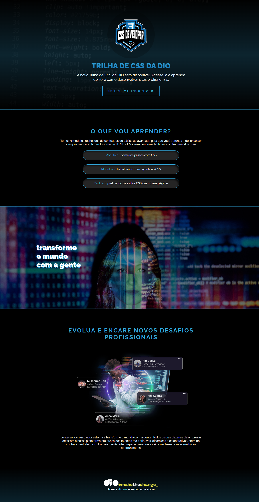

# Tech School Landing Page

This Tech School Landing Page is a modern and innovative website designed to promote a tech school that teaches new developers using HTML and various features from CSS. The website is built with the concept of mobile-first, ensuring a seamless browsing experience on all devices.

## Features

- Mobile-first and responsive design
- Clear and intuitive navigation
- Detailed information on the courses and services offered
- Testimonials from previous students
- Call-to-action button for enrollment

## Technologies Used

- HTML5: Used to structure the website's content and layout.
- CSS3: Used to style the website's layout and design, including color schemes, typography, and animations.

## Usage

To view the website, simply visit the live site or download the project files and open the `index.html` file in your preferred web browser. The website can be easily customized and modified to fit your specific school needs.

## Contributing

Contributions to this project are welcome! Feel free to fork this repository and submit a pull request with your changes.

## Credits

This project was built by [Burntroll](https://github.com/Burntroll).

## License

This project is licensed under the [MIT License](https://opensource.org/licenses/MIT).

## Results

